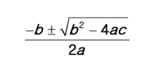

1. Python 예약어 

   python에서 사용할 수 없는 식별자(예약어)를 찾아 작성하시오.

   ```bash
   숫자가 첫자로 오는 경우
   미리 정의한 예약어
   Fasle, None, True, and, as, assert, async, await, break, class, continue, def, del, elif, else, except, finally, for, from, global, if, import, in, is, lambda, nonlocal, not, or, pass, raise, return, try, while, with, yield
   ```

   

2. 실수 비교 

   python은 부동소수점 방식을 이용하여 실수(float)를 표현하는 과정에서, 나타내고자 하는 값과의 오차가 발생하여 원하는 대로 연산 또는 비교가 되지 않을 때가 있다. 이를 참고하 여, 아래와 같은 두 실수 값을 올바르게 비교하기 위한 코드를 작성하시오

   ```python
   num1 = 0.1 * 3
   num2 = 0.3 
   import math
   math.isclose(num1, num2)
   ```

   

3. 이스케이프 시퀀스

   (1) 줄 바꿈, (2) 탭, (3) 백슬래시를 의미하는 이스케이프 시퀀스를 작성하시오.

   ```python
   - 줄 바꿈 : \n
   - 탭 : \t
   - 백슬래시 : \\
   ```

   

4. String Interpolation

   ‘안녕, 철수야’를 string interpolation을 사용하여 출력하시오.

   ```python
   name = '철수'
   print(f"'안녕, {name}야'")
   ```

   

5. 형 변환

   다음 중, 실행 시 오류가 발생하는 코드를 고르시오 : int('3.5')

   ```python
   str(1)                    # '1'
   int('30')                 # 30
   int(5)                    # 5
   bool('50')                # True
   int('3.5')                # 오류 => float('3.5')
   ```

6. 네모 출력

   두 개의 정수 n과 m이 주어졌을 때, 가로의 길이가 n, 세로의 길이가 m인 직사각형 형태를 별(*) 문자를 이용하여 출력하시오. 단, 반복문은 사용할 수 없다.

   ```python
   a = int(input())
   b = int(input())
   print(("*" * a + "\n") * b) 
   ```
   
   
   
7. 이스케이프 시퀀스 응용

   print() 함수를 한 번만 사용하여 다음 문장을 출력하시오.

   ```python
   "파일은 c:\Windows\Users\내문서\Python에 저장이 되었습니다."
   나는 생각했다. 'cd를 써서 git bash로 들어가 봐야지.'
   ```

   ```python
   print("\"파일은 c:\\Windows\\Users\\내문서\\Python에 저장이 되었습니다.\"\n나는 생각했다. \'cd를 써서 git bash로 들어가 봐야지.\'")
   ```

   

8.  근의 공식

   다음은 이차 방정식의 근을 찾는 수식이다. 이를 파이썬 코드로 작성하시오.

   

   ```python
   a = int(input())
   b = int(input())
   c = int(input())
   x1 = (-b + (b ** 2 - 4 * a * c) ** 0.5) / (2 * a)
   x2 = (-b - (b ** 2 - 4 * a * c) ** 0.5) / (2 * a)
   print(x1)
   print(x2)
   ```
   
   

